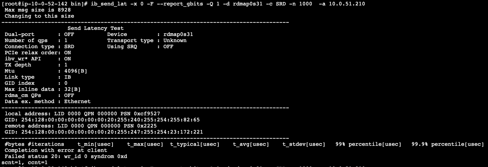
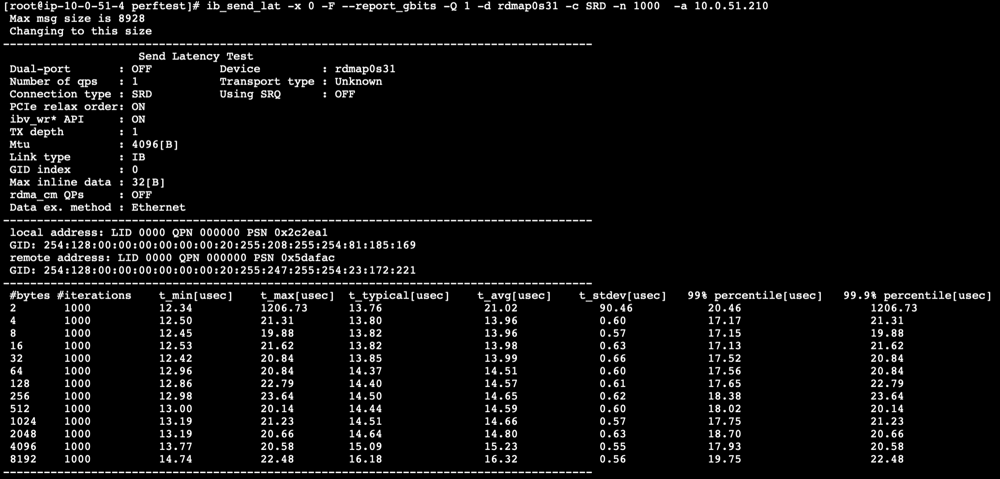

# EFA Cross Subnet Connectivity Test w/ EKS

## Repro

Steps are executed after the infra has deployed.

Instances named `efa-1` are in a different subnet than `efa-2` instances, but both are in the same AZ.

1. Using SSM, connect to `efa-1` instance and start a server session:

```sh
ib_send_lat -x 0 -F --report_gbits -Q 1 -d rdmap0s31 -c SRD -n 1000  -a
```

2. Using SSM, connect to `efa-2` instance and start a client session, using the IP of the server in step 1

```sh
ib_send_lat -x 0 -F --report_gbits -Q 1 -d rdmap0s31 -c SRD -n 1000  -a <SERVER-IP>
```

- When executing across different subnets (1 and 2 above), the client hangs and times out:



- When executing across instances in the *same subnet (i.e. `efa-1` instance to another `efa-1` instance), it works as expected:


